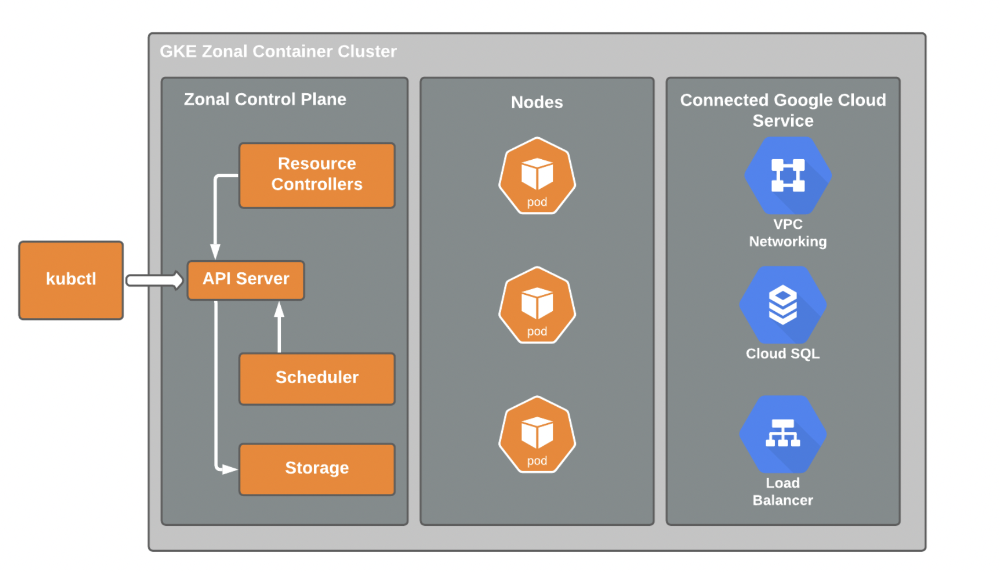

# Bills and Budget - Google Cloud Platform

## Budgets and alerts

Per billing account or per project.

* Fixed or tied to another metric.

* Percentage of previous month's spend.

    

* Budget limit 20,000 - alert 90% - 18,000.

* Billing export - store export info.

* Big query data set.

* Reports - GCP - monitor your expenditure.

* Error - rate quota - reset.

* Reset after specific time.

* Kubernetes engine - 1000 calls to APIs - every second.

* Allocation quota - 5 private cloud networks per project.

* Can request increase from Google cloud support.
