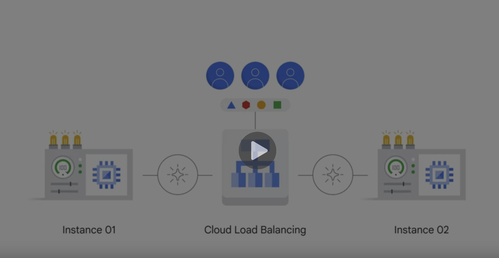

# Cloud load balancing

* App can be provided by 4VMs one moment and 40 VMs at another.
* This is done through cloud load balancing. Distribute user traffic over multiple instances of your application. Reduces risk of app performance issue.
* Can be HTTP, HTTPS, or SSL traffic.
* Multi region failover.
* Cloud load balancing reacts to changes in backend health, e.g, network.

    

    (Image taken from [Coursera > Google Cloud Fundamentals > Cloud load Balancing](https://www.coursera.org/learn/gcp-fundamentals/lecture/AXb5t/cloud-load-balancing))