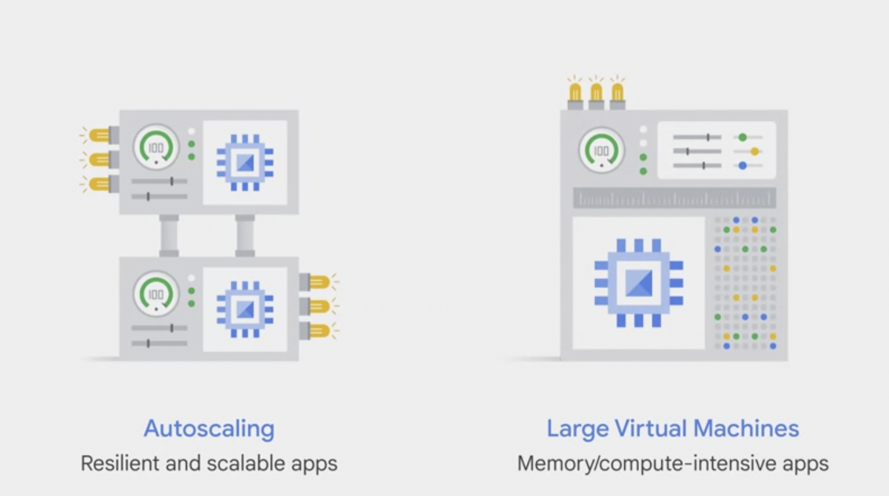

# Scaling VM

* **Computer Engine** - choose predefined machine types or custom machine types (number of VPC + memory).
* *Auto scaling* - VMs can be added/subtracted from apps - based on load balancing - take away VM.
* **Google VPC** - Different types of load balancing.
* Computer Engine - number of virtual CPUs. Large number of VMs. Most customers scale out not up.

  

Image taken from [Coursera > Google Cloud Fundamentals > Scaling VMs](https://www.coursera.org/learn/gcp-fundamentals/lecture/0FQqh/scaling-virtual-machines). 
