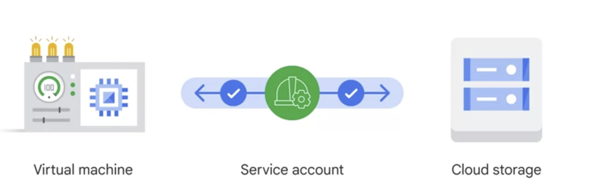

# Service Account

* Give permissions to protect Computer engineer virtual machine not a person.
* Service account to authenticate that VM to cloud roles. Better security. 
* Service account is an **identity** and **resource**. Can have policies, editor and viewer roles.

    

    Image taken from [Coursera: Google Cloud fundamentals](https://www.coursera.org/learn/gcp-fundamentals/home/week/3).