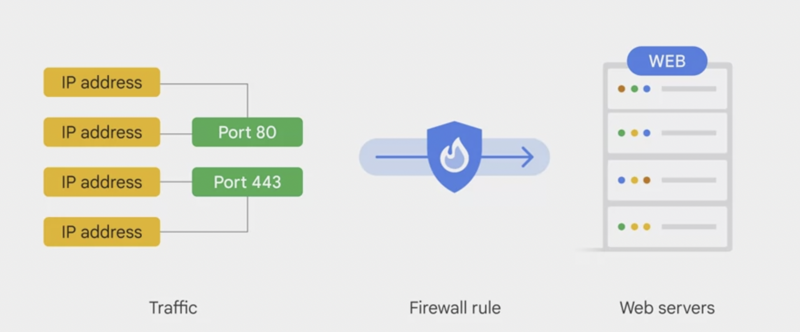

# Important VPC Compatibilities

## Virtual Private Cloud

* Routing tables built in - no router provisioning. Forward traffic from one instance to another on the same network or between Google cloud zones without external IP address.
* VPC provide firewall - restrict instances incoming and outgoing traffic.
* Can tag all servers and write firewall rule to include that tag.
* Can configure shared VPC.

  

  Image taken from [Google Cloud Fundamentals > Important VPC Compatibilities](https://www.coursera.org/learn/gcp-fundamentals/lecture/CwJdl/important-vpc-compatibilities).
